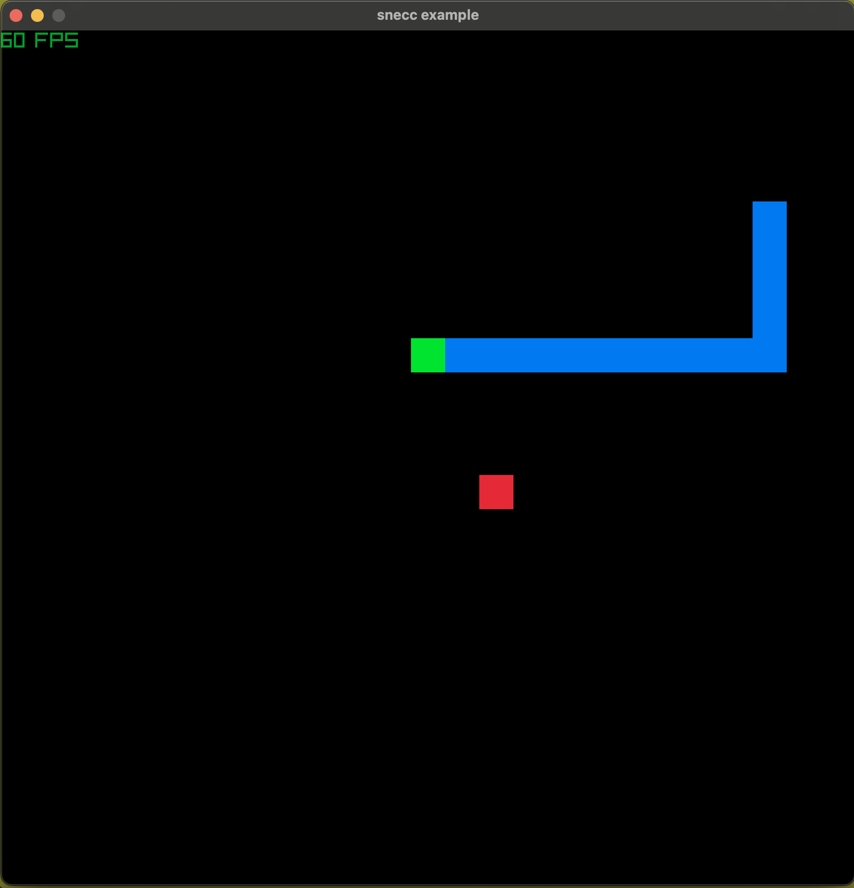

# ECC
A super simple, minimal entity component system that is implemented within a single header file in C as a learning exercise.

`ecc` has a very similar architecture to my Go ECS implementation [`ecgo`](https://github.com/Evankj/ecgo) but using very basic memory arenas and linked lists and some questionable pointer arithmetic.

## Running the example
There is a simple Snake example included that utilises [`raylib`](https://www.raylib.com/) for input handling and rendering.

You can run the example with the following command (you may need to update the makefile to point to wherever your raylib library is located):
```sh
make snecc
```



## Running the (minimal, scuffed) tests
```sh
make test
```

## Running the super basic benchmark
```sh
make benchmark
```

## Complexity
I am actively trying to keep this project simple and easy to work with, current LoC stats are provided below.

```
===============================================================================
 Language            Files        Lines         Code     Comments       Blanks
===============================================================================
 C Header                1          454          283           73           98
===============================================================================
 Total                   1          454          283           73           98
===============================================================================
```
